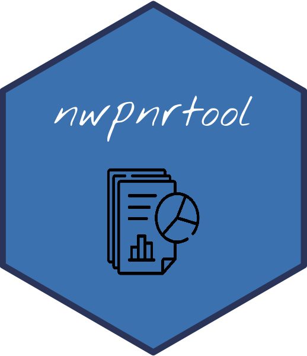

<!-- README.md is generated from README.Rmd. Please edit that file and click on Knit button at the end. -->

# nwpnrtool R package <a href='https://ob7-ird.github.io/nwpnrtool'></a>

<!-- badges: start -->

[](https://www.tidyverse.org/lifecycle/#experimental)
[](https://github.com/OB7-IRD/acdc/actions)
[](https://CRAN.R-project.org/package=nwpnrtool)

<!-- badges: end -->

***National Work Plans And Report Tool***

## Overview

R toolbox package for the National Work Plan and Report for the
contribution to the IRD’s DCF.

## Installation

``` r
devtools::install_github("https://github.com/OB7-IRD/nwpnrtool",
                         INSTALL_opts=c("--no-multiarch"))
```

### Development version

To get a bug fix or to use a feature from the development version, you
can install the development version of nwpnrtool from GitHub.

``` r
devtools::install_github("https://github.com/OB7-IRD/nwpnrtool",
                         ref = "development",
                         INSTALL_opts=c("--no-multiarch"))
```

## Usage

``` r
library(nwpnrtool)
# Next steps example will be added later
```

## Getting help

If you encounter a clear bug, please file an issue with a minimal
reproducible example on [GitHub issues
page](https://github.com/OB7-IRD/nwpnrtool/issues). This link is also
available if you have any questions and improvement propositions.
